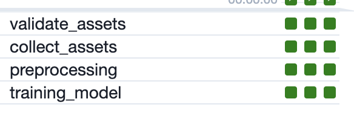
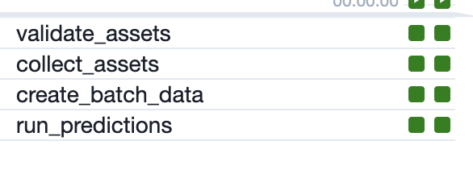

# infra-mlops
Stack: Airflow + Fastapi

## Contenido
1) Estructura del proyecto
2) Etapas del proyecto
3) Endpoint
4) Instalacion y ejecucion
5) Comentarios y mejoras

## Estructura del proyecto

```
spike_challenge
├── README.md
├── airflow
│   ├── artifacts
│   ├── config
│   ├── dags
│   │   ├── 1_training_pipeline.py
│   │   ├── 2_batch_prediction.py
│   ├── data
│   ├── logs
│   └── plugins
├── app
│   ├── app
│   ├── nginx.conf
│   └── requirements.txt
├── docs
├── model_package                       # Files for training and preprocessing
│   ├── model
│   │   ├── __main__.py
│   │   ├── steps
│   │   │   ├── __init__.py
│   │   │   ├── data.py
│   │   │   └── model.py
│   │   └── utils
│   │       ├── __init__.py
│   │       ├── config.py
│   │       ├── constants.py
│   │       └── transformers.py
│   ├── requirements-test.txt
│   ├── requirements.txt
│   ├── setup.py
│   └── tests
├── pytest.ini
├── docker-compose.yml                
├── airflow.Dockerfile
└── service.Dockerfile
```
## Etapas del proyecto
- Se realizaron dos dags: uno para el entrenamiento del modelo y otro para hacer predicciones en batch

- El primer dag (1_training_pipeline.py) esta enfocado al procesamiento de los datos. Este dag tiene 4 steps: la validacion de datos, la recolecion de datos, preprocesamiento y el entrenamiento. En la validacion se comprueba que la data input siga un esquema de datos definido. La recoleccion genera un archivo a partir de las fuentes de datos originales. Mientras que el preprocesamiento crea las tablas necesarias para que puedan ser usadas durante el entrenamiento, ademas de generar un pipeline de sklearn. Finalmente, el entrenamiento crea un modelo entrenado serializado.


- El segundo dag (2_batch_prediction.py) cuenta con 4 steps, y se encarga de generar las predicciones en batch.


## Endpoint
### Health check
Consultar a esta ruta para verificar que el api este activo

**URL** : `localhost:8090/check_service`

**Method** : `GET`

#### Ejemplo

```
curl --location --request GET 'localhost:8090/check_service'
```

#### Respuesta

**Code** : `200 OK`

```json
{
    "Message":"Hello world from service"
}
```

### Prediccion
Consultar por la prediccion de los datos enviados

**URL** : `localhost:8090/get_prediction`

**Method** : `POST`

#### Ejemplo

```
curl --location --request POST 'localhost:8090/get_prediction' \
--header 'Content-Type: application/json' \
--data-raw '{"data": {
        "popularity": [68],
        "danceability": [0.826],
        "energy": [0.704],
        "key": [9.0],
        "loudness": [-7.527],
        "mode": [1.0],
        "speechiness": [0.117],
        "acousticness": [0.189],
        "instrumentalness": [4.8e-05],
        "liveness": [0.0617],
        "valence": [0.741],
        "tempo": [94.013],
        "duration": [205000],
        "id_new": [0]
    }
}'  
```

#### Respuesta

**Code** : `200 OK`

```json
{
    "prediction": 1
}
```
## Ejecucion
- Primero, se debe construir y levantar los contenedores
```
docker-compose build
docker-compose up
```
- Para ver los dags, se debe entrar a la UI de airflow a traves de `localhost:8080` y usar como user y password _airflow_
- El api se puede consultar a traves de `localhost:8090`, usando los request de la seccion anterior

## Comentarios
- Usar una herramienta de monitoreo. Para las predicciones online, de debe implementar una conexion a una BD para el api en donde se guarden las predicciones que el modelo realiza asi como tambien los datos que recibe. Por otro lado, para las predicciones en batch, se guardan las predicciones y los features. Posteriormente, estos datos podran ser contrastados con los datos reales cuando se tengan y ser mostrados por un dashboard u otro medio.
- Respecto a la degradacion del modelo, se puede schedular el entrenamiento cada cierto tiempo de acuerdo a las metricas observadas.

## Mejoras
- Mejorar las pruebas que se han realizado. Por cuestion de tiempo no pude implementar mas.
- Mejorar la infraestructura usando Helm y Kubernetes en lugar de docker-compose